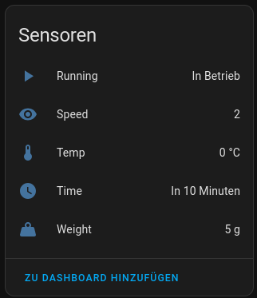
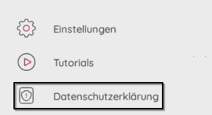
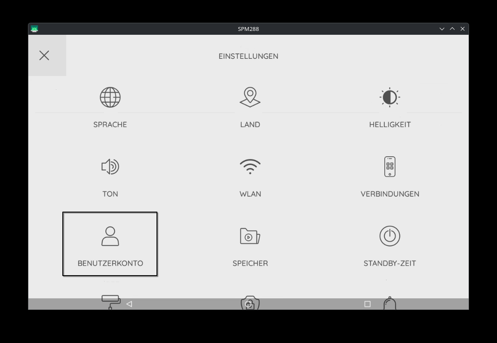
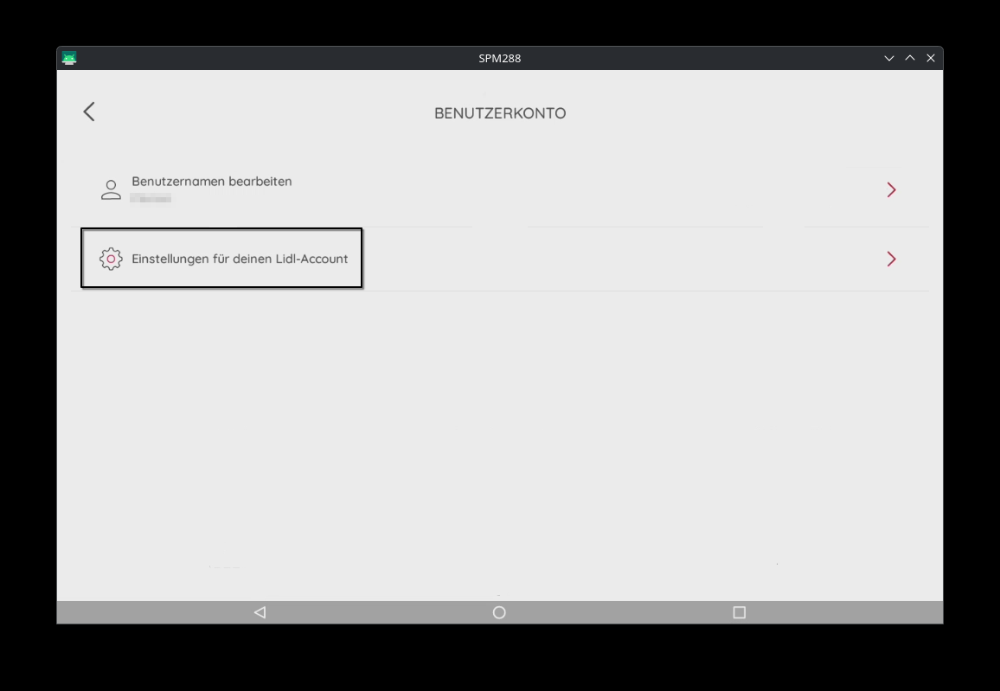
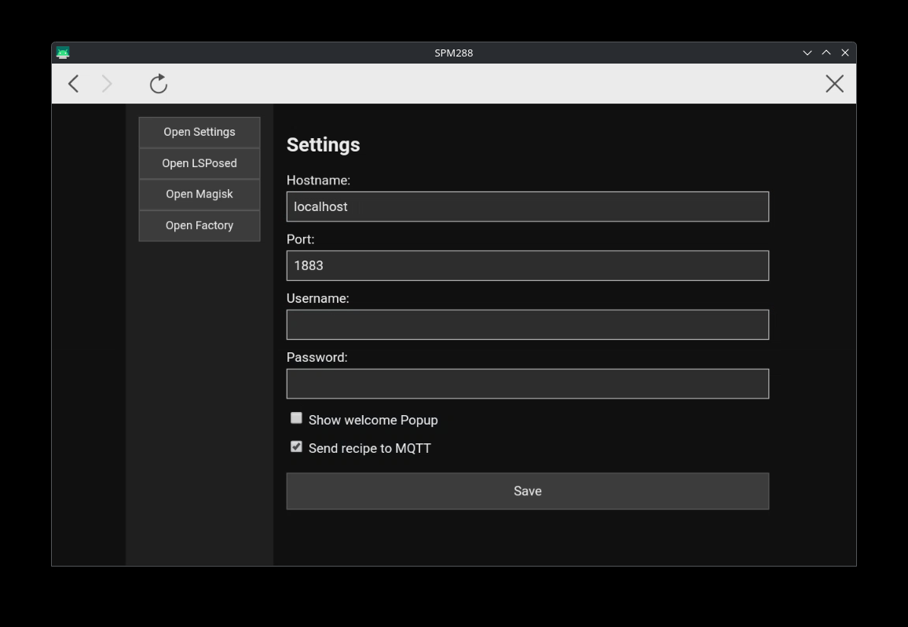

# Monsieur Cuisine 2 MQTT
> [!CAUTION]
> Heavily work in progress, download from Actions.

> [!WARNING]  
> The module hooks the Monsieur Cuisine app, do this with your own caution, I take no responsibility

This app is a LSPosed module which hooks into the Monsieur Cuisine app of the Monsieur Cuisine Smart cooking device, adding it's own Serial data listener and then return this data to Homeassistant

## Requirements
You need to have a rooted machine, with Magisk and the LSPosed module installed (also install the LSPosed manager, this way its easier for you to open it, this can be found inside the ZIP file of the LSPosed Zygisk module)
A guide on how to do this can be found here:
https://github.com/EliasKotlyar/Monsieur-Cuisine-Connect-Hack/issues/38#issuecomment-1928542640

Afterwards compile and install the APK on the device and enable it for the Monsieur Cuisine app inside the LSPosed manager.

Another requirement is Homeassistant with a MQTT server set up, when you have done that correctly and everything is configured properly and you launch the Monsieur Cuisine App it will start sending data to MQTT server, where Homeassistant will automatically discover it.

In the end it should look like this:

Clicking the privacy policy inside the main menu will open the module app:

## Features

- [x] Implement listener for serial data
- [x] Send data to MQTT
- [ ] Implement saving of MQTT preferences
- [x] Hook button inside MC-App to show the module settings
- [ ] Add utilities inside module settings
- [x] (WIP) Add Hook to get selected recipe

## Changing settings
Either open the MCS2MQTT app on your Monsieur Cuisine or do the following:

Go to the account page first:

Then click on account settings:

Change the settings and click on save, then kill the Monsieur Cuisine app and start it again:

